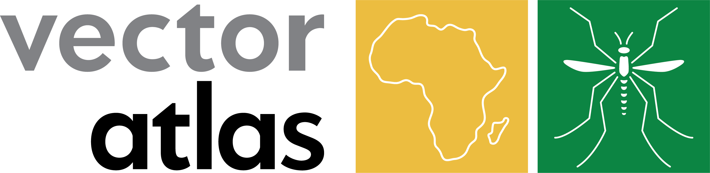

# \
# Training resources hub [IN DEVELOPMENT]

This repository contains linkages to a curated set of free online resources for self-directed and mentored learning on data management, visualisation, basic spatial analysis and presentation, and modelling of mosquito disease vectors, tailored to collaborators of the **Vector Atlas**.

## Data management, manipulation, and presentation

### The R Language

#### R Programming
Roger D. Peng

[https://www.coursera.org/learn/r-programming](https://www.coursera.org/learn/r-programming)

This is a popular R introductory course and is free on Coursera from Johns Hopkins University. The course is a comprehensive foundation in fundamentals of base-R, but is a large commitment in time to complete and does not cover a number of modern areas of R-programming like `tidyverse`.

## Spatial data manipulation

#### Spatial data with `terra`
https://rspatial.org/spatial/index.html#

### 

## Species distribution modelling 

#### Species distriubtion modelling for vectors course
Golding and Ryan
https://github.com/geryan/vector_sdm_course

####  Species distribution modelling 
Hijmans and Elith
https://rspatial.org/sdm/index.html

#### Boosted regression trees

